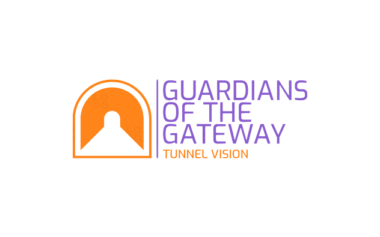

    

## Overview

Tunnel Vision enables the configuration, setup, and management of OpenVPN
tunnels.

Tunnel Vision provides a streamlined interface to the [easy-rsa CA
utility](https://github.com/OpenVPN/easy-rsa), certificate generation, OpenVPN server
and client configuration, for secure communication.

Tunnel Vision is built and run on a Linux-based system and requires superuser
privileges.

## Build requirements

* `Python 3` - The project uses Python 3 for its source code.
* `OpenVPN` - Creates and manages VPN tunnels.
* `Git` - Clone the `easy-rsa` repository from GitHub.
* `Linux`

Learn more about project structure and getting started on the [Get
Started](./docs/get-started.md) page.

## Installation

Tunnel Vision is a python project built on Linux follow these steps to set up
the project on your machine:

1. **Install project requirements** including `Python 3`, `OpenVPN`, and `Git`
   make sure they are installed on your Linux machine.
2. **Fork** the repository using the secure shell (SSH) link:
   `git@github.com:jbjulia/tunnel-vision.git`
3. From your fork, **clone the repository** to your local machine.
4. In your terminal, **select the directory** you saved the project in.
5. Make the `tv.py` script executable by running the following command `chmod
   +x tv.py`.
6. Execute the script with **superuser** privileges using `sudo ./tv.py`.

## Configure a tunnel

1. Launch the application.
2. Run the script `tv.py`.
3. Select **Create Tunnel**.
4. Enter **Tunnel Information** such as a name and Internet Protocol (IP)
   address for the tunnel.
5. Review the configuration and confirm the settings to proceed.

### Manage existing tunnels

1. Launch the Application.
2. Run the `tv.py` script.
3. Select **Manage Tunnels**.
4. **Modify or Delete Tunnels**.

### Connect to a server

1. Select **Connect to Server**.
2. From the list of servers in the `servers.json`, **choose a server you want
   use**.
3. **Enter Credentials** to establish connection.

Read more detailed setup and configuration information on the [Tunnel
configuration](./docs/tunnel-config.md) page.

## Styling and contributing

> **Note:** Do not clone directly on the Tunnel Vision master branch. You
> **MUST** create your own fork then clone that fork.

Read additional information about styling and the conventions in the `docs-build`
module `README` file.

## License

Tunnel Vision is open source software licensed under the [MIT License](LICENSE).
